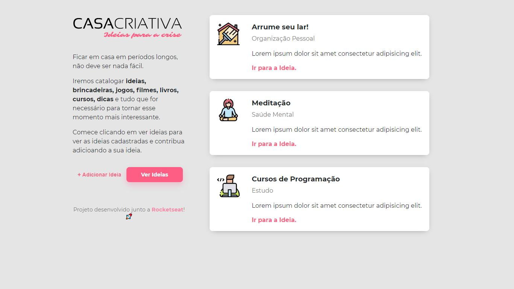
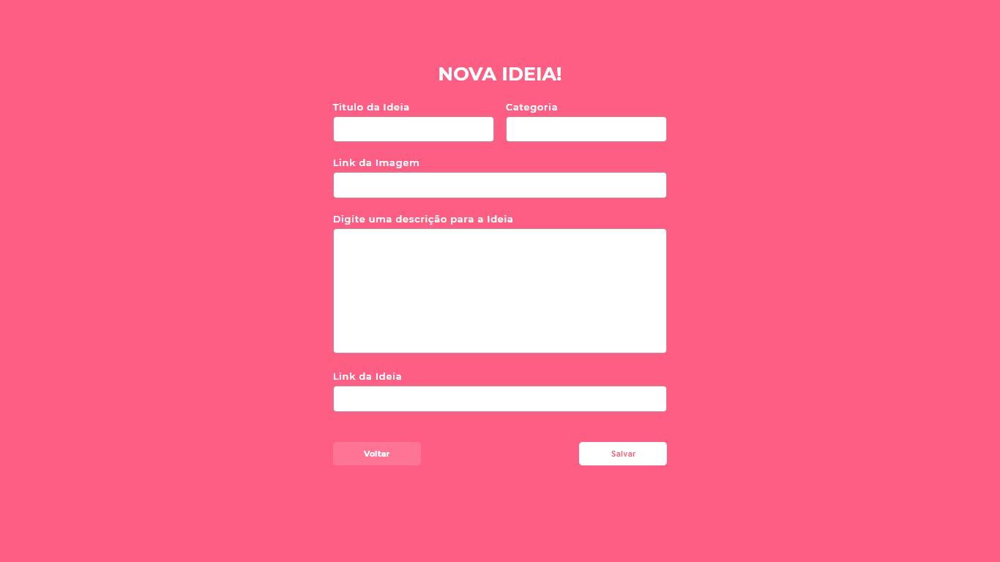
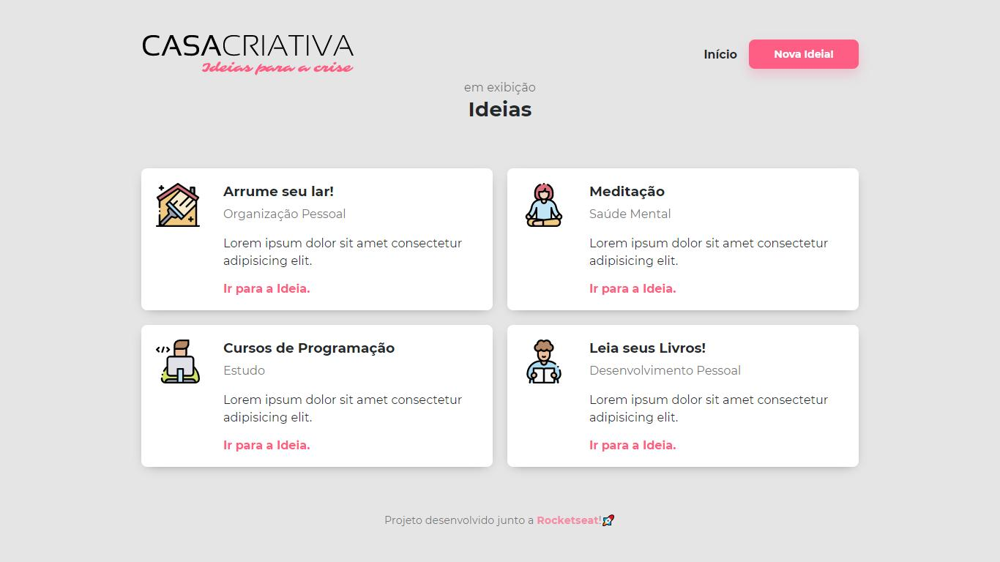

   </img>

 

  <a href="#rocket-tecnologias">Tecnologias</a>&nbsp;&nbsp;&nbsp;|&nbsp;&nbsp;&nbsp;
  <a href="#-projeto">Projeto</a>&nbsp;&nbsp;&nbsp;|&nbsp;&nbsp;&nbsp;
  <a href="#art-projeto">Layout</a>&nbsp;&nbsp;&nbsp;|&nbsp;&nbsp;&nbsp;
  <a href="#memo-licença">Licença</a>

 

## :rocket: Tecnologias

Esse projeto foi desenvolvido com as seguintes tecnologias:

- JavaScript
- CSS
- HTML
- Express
- Nunjucks
- SQLite

## 💻 Projeto

Aplicação do WorkshopDev chamada "Casa Criativa", tem em objetivo unir suas ideias em um único só lugar, você pode adicionar passa-tempos, tarefas e cursos que pretende fazer nessa crise. O usuário poderá ver todas as ideias , além de criar novas ideias e inclui-las na listagem.  

## :art: Projeto

| Página principal                           | Formulário para adicionar novas ideias                           | Lista de ideias                            |
| ------------------------------------------ | ---------------------------------------------------------------- | ------------------------------------------ |
|  |  |  |

## :memo: Licença

Esse projeto está sob a licença MIT. Veja o arquivo [LICENSE](LICENSE.md) para mais detalhes.
